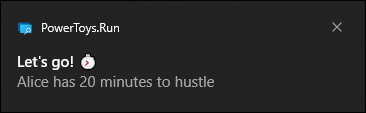
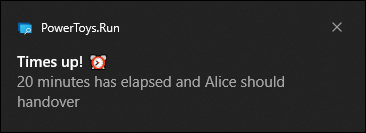
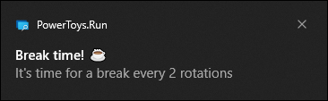
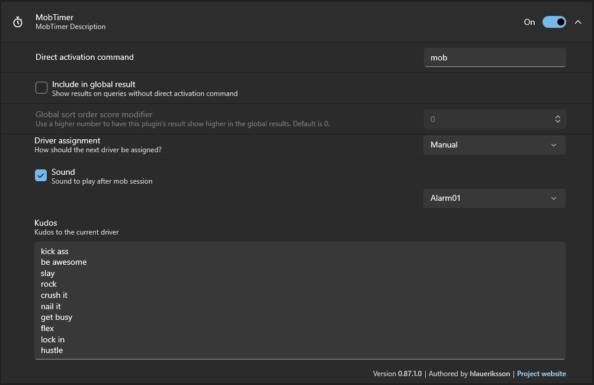
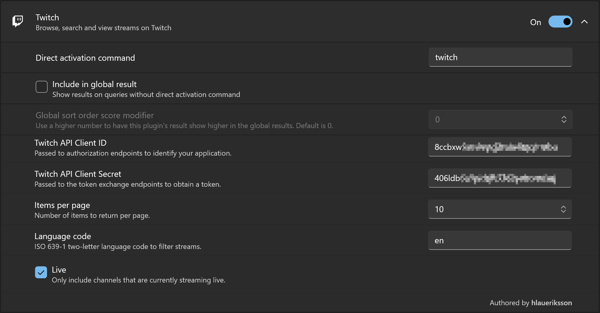

# Community.PowerToys.Run.Plugins<!-- omit in toc -->

<a href="https://www.flaticon.com/free-icons/database" title="database icons">Database icons created by Stockio - Flaticon</a>
<a href="https://www.flaticon.com/free-icons/timer" title="timer icons">Timer icons created by Ilham Fitrotul Hayat - Flaticon</a>

pin FluentAssertions
bump nugets

TODO/Bugs:

Dependencies?

bang:
bang wiki sdf
ladda ner bilder

dencode:
options; Encoding, LineEnding, TimeZone
settings: order encode first, decode first
översättningar

dice:
d20;DnD
" D100 + 2";" Foo Bar ;o)"
Reroll, context menu action
Settings, as one multiline textbox

need:
 need "support for quotes" please
 need 'support for single quotes' please
 need support for\nline\nbreaks\nplease
open url, path
paste into cursor

twitch:
ladda ner profil bilder?
 // https://dev.twitch.tv/docs/api/reference#get-followed-streams
 // https://dev.twitch.tv/docs/api/guide#pagination
 // https://dev.twitch.tv/docs/api/guide#twitch-rate-limits
 // https://devstatus.twitch.tv/

---

Nästa plugins;
https://github.com/microsoft/PowerToys/issues/3200#issuecomment-641528879
https://github.com/microsoft/PowerToys/issues/3200#issuecomment-757386158

Google Translate plugin

YouTube plugin

Obsidian plugin

Azure Portal plugin

Playwright scraping plugin?

---

https://shields.io/badges
https://www.flaticon.com/
https://simpleicons.org/

---

[](https://github.com/hlaueriksson/Community.PowerToys.Run.Plugins/actions/workflows/build.yml)
[](https://github.com/hlaueriksson/Community.PowerToys.Run.Plugins/actions/workflows/snyk.yml)
[](https://codeclimate.com/github/hlaueriksson/Community.PowerToys.Run.Plugins/maintainability)
[](https://github.com/hlaueriksson/awesome-powertoys-run-plugins)

> 🗂️🔎 Community PowerToys Run Plugins 🔌

[](https://learn.microsoft.com/en-us/windows/powertoys/run)

The plugins has been developed and tested with PowerToys `v0.87.1`.

Prerequisites:

1. [Install PowerToys](https://docs.microsoft.com/en-us/windows/powertoys/install)

## Contents<!-- omit in toc -->

- [Bang](#bang)
- [DenCode](#dencode)
- [Dice](#dice)
- [MobTimer](#mobtimer)
- [Need](#need)
- [Twitch](#twitch)

## Bang

[](https://duckduckgo.com)

[](https://duckduckgo.com/bangs)

> Search websites with DuckDuckGo !Bangs

ActionKeyword: `bang`

DuckDuckGo is a search engine that doesn't track your search history.
Bangs are shortcuts that lets you quickly search other sites.
For example, when you know you want to search Wikipedia or IMDb, DuckDuckGo !Bangs gets you there faster.

Read more:

- <https://duckduckgo.com/bangs>


### Installation<!-- omit in toc -->

1. Download the `.zip` file from the latest [release](https://github.com/hlaueriksson/Community.PowerToys.Run.Plugins/releases/latest) and extract it to:
   - `%LocalAppData%\Microsoft\PowerToys\PowerToys Run\Plugins`
2. Restart PowerToys

### Usage<!-- omit in toc -->

1. Open PowerToys Run with `alt + space`
2. Type `bang`
   - A list of common website bangs will be displayed
3. Continue to type to find website bangs
4. Use ⬆️ and ⬇️ keys to select a website bang
5. Continue to type to query the selected website bang
   - A list of search suggestions will be displayed
6. Press `Enter` to open the website and perform the search

## DenCode

[](https://dencode.com)

[](https://dencode.com)

> Encoding & Decoding

ActionKeyword: `dencode`

DenCode is a web site that lets you encode and decode values.
For example, HTML Escape / URL Encoding / Base64 / MD5 / SHA-1 / CRC32 / and many other String, Number, DateTime, Color, Cipher and Hash formats.

Read more:

- <https://dencode.com>


### Installation<!-- omit in toc -->

1. Download the `.zip` file from the latest [release](https://github.com/hlaueriksson/Community.PowerToys.Run.Plugins/releases/latest) and extract it to:
   - `%LocalAppData%\Microsoft\PowerToys\PowerToys Run\Plugins`
2. Restart PowerToys

### Usage<!-- omit in toc -->

1. Open PowerToys Run with `alt + space`
2. Type `dencode`
   - A list of all conversions will be displayed
3. Continue to type to find conversions
4. Use ⬆️ and ⬇️ keys to select a conversion
5. Continue to type to enter a value to encode / decode
   - A list of encodings / decodings will be displayed
6. Press `Enter` to copy the selected encoding / decoding to clipboard
7. Press `Ctrl + Enter` to open the selected encoding / decoding on the DenCode website

## Dice

[](https://rolz.org/help/api)

[](https://rolz.org)

> Roleplaying Dice Roller

ActionKeyword: `roll`

Rolz is a free tool for rolling dice for roleplaying games.
Dice Codes lets you express the specific dice to roll and the rules system to use.
For example, `D6+1` to roll a six sided die and add 1 or `2D20H` to roll two 20 sided dice and keep the highest.

Read more:

- <https://rolz.org>

Dice Codes:

- <https://rolz.org/help/general>
- <https://rolz.org/wiki/inframe?w=help&n=basiccodes>
- <https://rolz.org/wiki/inframe?w=help&n=successcodes>


### Installation<!-- omit in toc -->

1. Download the `.zip` file from the latest [release](https://github.com/hlaueriksson/Community.PowerToys.Run.Plugins/releases/latest) and extract it to:
   - `%LocalAppData%\Microsoft\PowerToys\PowerToys Run\Plugins`
2. Restart PowerToys

### Usage<!-- omit in toc -->

1. Open PowerToys Run with `alt + space`
2. Type `roll`
   - A list of preconfigured roll expression will be displayed
3. Use ⬆️ and ⬇️ keys to select a roll expression
4. Press `Enter` to roll the expression
   - The result will be displayed
5. Continue to type to change the roll expression
   - The result will be displayed
6. Press `Enter` to copy the selected result to clipboard
7. Press `Ctrl + C` to copy the selected roll details to clipboard

### Settings<!-- omit in toc -->

Add, update or delete preconfigured roll expressions via the plugin settings.


The settings are stored in the file:

- `DiceSettings.json`

Located in the folder:

- `%LocalAppData%\Microsoft\PowerToys\PowerToys Run\Settings\Plugins\Community.PowerToys.Run.Plugin.Dice\`

## MobTimer

[](https://en.m.wikipedia.org/wiki/Team_programming#Mob_programming)

> Timer for mob programming

ActionKeyword: `mob`

MobTimer is a tool for time tracking in mob programming sessions.
Get notifications when to rotate driver and take breaks.


Terms:

- Session
   - A dedicated period when the entire team collaborates on a single coding task using a single computer. Sessions can last anywhere from a short focused period to a full workday.
- Rotation
   - The structured process of changing roles among team members at regular intervals. A session is split into several rotations.
- Driver
   - The person actively typing and implementing the team's decisions on the shared computer. Change the driver after each rotation.

### Installation<!-- omit in toc -->

1. Download the `.zip` file from the latest [release](https://github.com/hlaueriksson/Community.PowerToys.Run.Plugins/releases/latest) and extract it to:
   - `%LocalAppData%\Microsoft\PowerToys\PowerToys Run\Plugins`
2. Restart PowerToys

### Usage<!-- omit in toc -->

1. Open PowerToys Run with `alt + space`
2. Type `mob`
   - A list of actions and information will be displayed
4. Use ⬆️ and ⬇️ keys to select an action

Actions:

- Start/pause/clear timer
- Set/reset duration
- Set/reset break
- Add/move/remove participant
- Set participant as driver (manually)
- Export session
- Import session

Set duration:

1. Type `mob <minutes>`
2. Select the _Set duration_ action
3. Press `Enter` to set the duration of rotations

Example:

- `mob 25`

Set break:

1. Type `mob <rotations>`
2. Select the _Set break_ action
3. Press `Enter` to set breaks after completing the number of rotations

Example:

- `mob 3`

Add participant:

1. Type `mob <name>`
2. Press `Enter` to add the participant to the session

Example:

- `mob Dave`

Export session:

1. Type `mob export`
2. Press `Enter` to export the session to a JSON string and and copy it to the clipboard

Example result:

```
mob import {"Duration":{"Value":20},"Breaks":{"Value":2},"Participants":[{"Name":"Alice","Rotations":[]},{"Name":"Bob","Rotations":[]},{"Name":"Charlie","Rotations":[]}],"Driver":null,"Rotations":[]}
```

Import session:

1. Type `mob import <json>`
2. Press `Enter` to import a session from a JSON string

Notifications:







### Settings<!-- omit in toc -->

Change:

- how the next driver should be assigned
- if and what sound should be played after end of rotation
- kudos to the current driver



The session is stored in the file:

`MobTimerSession.json`

Located in the folder:

- `%LocalAppData%\Microsoft\PowerToys\PowerToys Run\Settings\Plugins\Community.PowerToys.Run.Plugin.MobTimer\`

## Need

[](https://en.wikipedia.org/wiki/Key%E2%80%93value_database)

> Store things you need, but can't remember

ActionKeyword: `need`

Need is a key-value store for things that you think are important and want to keep handy later.
Find stored values and copy them to clipboard.
Use CRUD operations to manage the store.
For example, `need repo https://github.com/hlaueriksson/Community.PowerToys.Run.Plugins` to add the URL of this GitHub repository to the store.


### Installation<!-- omit in toc -->

1. Download the `.zip` file from the latest [release](https://github.com/hlaueriksson/Community.PowerToys.Run.Plugins/releases/latest) and extract it to:
   - `%LocalAppData%\Microsoft\PowerToys\PowerToys Run\Plugins`
2. Restart PowerToys

### Usage<!-- omit in toc -->

1. Open PowerToys Run with `alt + space`
2. Type `need`
   - A list of saved records will be displayed
3. Continue to type to find saved records via key or value
4. Use ⬆️ and ⬇️ keys to select a record
5. Press `Enter` to copy the value of the selected record to clipboard
6. Press `Ctrl + C` to copy the selected record details to clipboard
7. Press `Ctrl + Del` to delete the selected record

Add record:

1. Open PowerToys Run with `alt + space`
2. Type `need`
3. Continue to type `<key> <value>`
   - Key without spaces
   - Separate with space ` `
   - Value with or without spaces
4. Press `Enter` to save the record

Example:

- `need mykey My value`

Update record:

1. Open PowerToys Run with `alt + space`
2. Type `need`
3. Continue to type `<key> <new value>`
   - Existing key without spaces
   - Separate with space ` `
   - New value with or without spaces
4. Press `Enter` to update the record

Example:

- `need mykey My new value`

### Settings<!-- omit in toc -->

Change the filename where records are stored via the plugin settings.


The records are, by default, stored in the file:

`NeedStorage.json`

Located in the folder:

- `%LocalAppData%\Microsoft\PowerToys\PowerToys Run\Settings\Plugins\Community.PowerToys.Run.Plugin.Need\`

## Twitch

[](https://dev.twitch.tv/docs/api/)

[](https://www.twitch.tv)

> Browse, search and view streams on Twitch

ActionKeyword: `twitch`

Twitch is a video streaming service where millions of people come together live every day to chat, interact, and make their own entertainment together.

Read more:

- <https://www.twitch.tv>


### Requirements<!-- omit in toc -->

1. A [Twitch](https://www.twitch.tv) account
2. An application with `Client ID` and `Client Secret` from the [Twitch Developer Console](https://dev.twitch.tv/console)

### Installation<!-- omit in toc -->

1. Download the `.zip` file from the latest [release](https://github.com/hlaueriksson/Community.PowerToys.Run.Plugins/releases/latest) and extract it to:
   - `%LocalAppData%\Microsoft\PowerToys\PowerToys Run\Plugins`
2. Restart PowerToys
3. Update the plugin settings:
   - Copy the `Client ID` and `Client Secret` from the application in the [Twitch Developer Console](https://dev.twitch.tv/console)
   - Paste the values to the `Twitch API Client ID` and `Twitch API Client Secret` settings

### Usage<!-- omit in toc -->

1. Open PowerToys Run with `alt + space`
2. Type `twitch`
   - A list of commands are displayed:
     - Top games
     - Search channels
     - Search categories
3. Continue to type to prepare for:
   - Search channels
   - Search categories
4. Use ⬆️ and ⬇️ keys to select a command
5. Press `Enter` to run the command

Find streams:

1. Open PowerToys Run with `alt + space`
2. Type `twitch` and select one of:
   - Top games
   - Search categories
3. Top games
   - Use ⬆️ and ⬇️ keys to select a game
4. Search categories
   - Continue to type to find categories or games
5. Press `Enter` to expand the selected category or game
   - A list of streams will be displayed
6. Use ⬆️ and ⬇️ keys to select a stream
7. Press `Enter` to open the stream on the Twitch website

Find channels:

1. Open PowerToys Run with `alt + space`
2. Type `twitch` and select:
   - Search channels
3. Search channels
   - Continue to type to find channels
4. Use ⬆️ and ⬇️ keys to select a channel
5. Press `Enter` to open the channel on the Twitch website

### Settings<!-- omit in toc -->

Set credentials and parameters for the Twitch API via the plugin settings.



The settings are stored in the file:

- `TwitchSettings.json`

Located in the folder:

- `%LocalAppData%\Microsoft\PowerToys\PowerToys Run\Settings\Plugins\Community.PowerToys.Run.Plugin.Twitch\`
